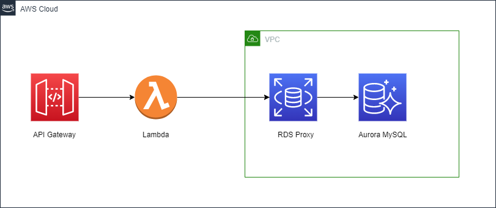
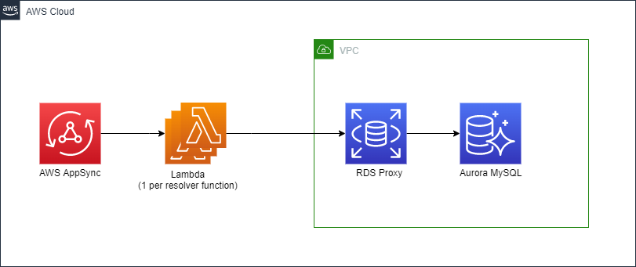
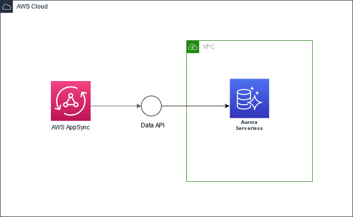
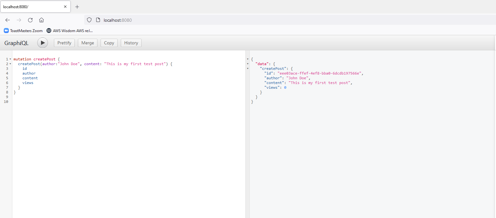
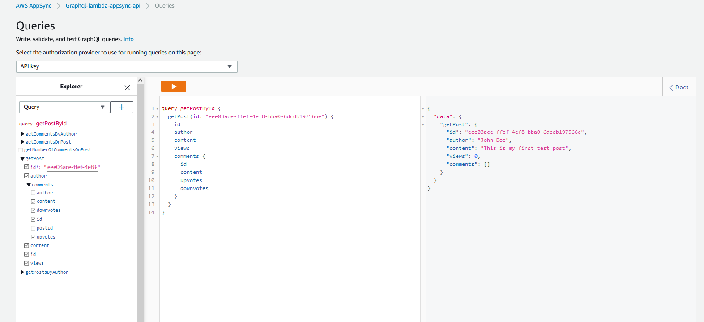

### GraphQL on AWS lambda with Java

This repository consists of sample code for three applications.
1. Self managed GraphQL API running on AWS Lambda.
2. AWS AppSync hosted GraphQL API with Direct Lambda Resolvers .
3. AWS AppSync hosted GraphQL API with RDS Resolver.

#### 1. Self Managed GraphQL application on AWS Lambda using graphql-java

Below is the architecture used for GraphQL on AWS Lambda. 
API Gateway provides an HTTPS entry point into the GraphQL server running on Lambda. 
A relational database running on Amazon Aurora MySQL cluster serves as the backend data store for the application. 
Lambda function connects to the Aurora cluster using RDS Proxy (https://aws.amazon.com/rds/proxy/).



#### 2. GraphQL applications on AWS AppSync with Direct Lambda Resolver

An alternative architecture using AWS AppSync and Lambda resolver looks as below. 
AppSync API exposes the GraphQL endpoint for client applications. 
The lambda resolver provides the business logic to resolve any queries and mutations for the API. 
The lambda resolver function connects to the backend Aurora cluster using RDS Proxy.



#### 3. GraphQL application on AWS AppSync with RDS Resolver

Another alternative approach to running GraphQL using AppSync with RDS resolvers.


##### Inside the repository:

<table>
    <th>Folder</th>
    <th>Purpose</th>
    <tr>
        <td>GraphqlLambda</td>
        <td>Maven application with code for Lambda function that runs GraphQL API using graphql-java library</td>        
    </tr>
    <tr>
        <td>LambdaResolver</td>
        <td>Maven application with code for AppSync Lambda Resolver</td>
    </tr>
    <tr>
        <td>DBInitLambda</td>
        <td>Maven application with code to initialize the database</td>
    </tr>
    <tr>
            <td>Infra</td>
            <td>
                CDK application for creating all the AWS components needed to run the three applications listed above.
            </td>
        </tr>
</table>

<br>

##### Deployment Instructions:

The following are pre-requisites for running the application

* AWS Account
* AWS CDK
* Java 11 or above
* Maven

Navigate to `Infra` folder in the local git repository and run the following CDK commands. <br>
`cdk synth` <br>
`cdk deploy --all`

 
#### Testing the sample application

To test the API using graphql-lambda, we can use GraphiQL a popular open source client and IDE used in GraphQL development. We can use the CDN version example provided at this Github repository (https://github.com/graphql/graphiql/tree/main/examples/graphiql-cdn) as a starting point.

Download or copy the contents of the index.html file provided in the above repository to a local file.
Open the local file and find the section below:

````
function graphQLFetcher(graphQLParams) {
        return fetch(
          'https://swapi-graphql.netlify.com/.netlify/functions/index',
          {
            method: 'post',
            headers: {
              Accept: 'application/json',
              'Content-Type': 'application/json',
            },
            body: JSON.stringify(graphQLParams),
            credentials: 'omit',
          },
        ).then(function (response) {
          return response.json().catch(function () {
            return response.text();
          });
        });
      }
````
Replace the URL from above with the URL to the API Gateway endpoint from the `graphql-lambda-self-managed-stack` CDK stack output.
To run the index.html, we need to deploy the file to a local webserver. You can use a simple nodejs based webserver like http-server (https://www.npmjs.com/package/http-server)
Once deployed to a local web server, open the index.html page and start interacting with the GraphQL API running on Lambda as shown below:


To test the AppSync versions of the API, you can navigate to AppSync Cosole on AWS (https://console.aws.amazon.com/appsync) and click on “Queries” section. 
This opens a embedded GraphiQL console where you can test your queries as shown below:


#### Cleanup ####
Navigate to `Infra` folder and run the following command to cleanup the AWS Resources
`cdk destroy --all` 

## Security

See [CONTRIBUTING](CONTRIBUTING.md#security-issue-notifications) for more information.

## License

This library is licensed under the MIT-0 License. See the LICENSE file.
